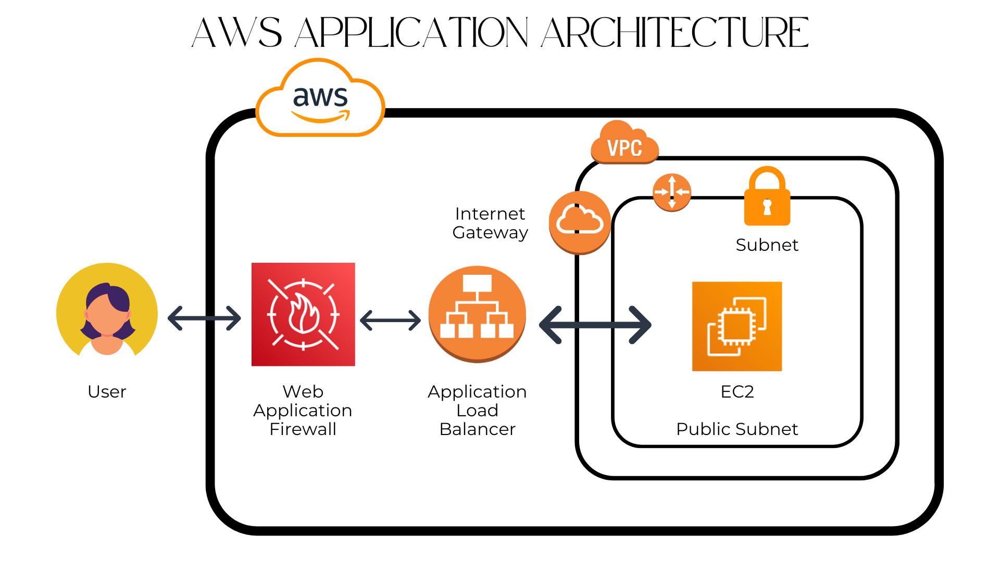

# CloudDefender

### Project Explanation and Objective

#### **Project Overview**  
In this project, I focused on setting up a **secure and scalable web application** leveraging **AWS services** like EC2, Application Load Balancer (ALB), and Web Application Firewall (WAF). The goal was to ensure the application could withstand online threats while maintaining its ability to handle high traffic efficiently.

#### **Key Components and Features**  
1. **EC2 Instances**:  
   Virtual servers that host the application, providing the necessary compute power to handle user requests.

2. **Application Load Balancer (ALB)**:  
   Distributes incoming traffic across multiple EC2 instances to ensure even load distribution, improving fault tolerance, availability, and scalability.

3. **Web Application Firewall (WAF)**:  
   Protects the application from common web threats like SQL injection, cross-site scripting (XSS), and malicious bots by filtering and monitoring HTTP/HTTPS requests.

#### **Objective**  
- **Security**:  
  To safeguard the application against potential cyberattacks and vulnerabilities, ensuring user data and application integrity remain intact.

- **Scalability**:  
  To ensure the application can handle sudden spikes in traffic without downtime or performance degradation.

#### **Why Use These AWS Services?**  

1. **AWS EC2**:  
   Provides on-demand, scalable computing resources, ensuring flexibility to scale up or down based on traffic needs.

2. **ALB**:  
   Enhances the application’s availability and ensures smooth traffic management by automatically routing requests to healthy servers.

3. **AWS WAF**:  
   Adds an additional layer of security by allowing fine-grained control over traffic rules, blocking harmful requests, and ensuring compliance with security best practices.

By combining these services, the project achieves a robust, scalable, and secure architecture, ideal for modern web applications facing dynamic traffic patterns and online threats.
